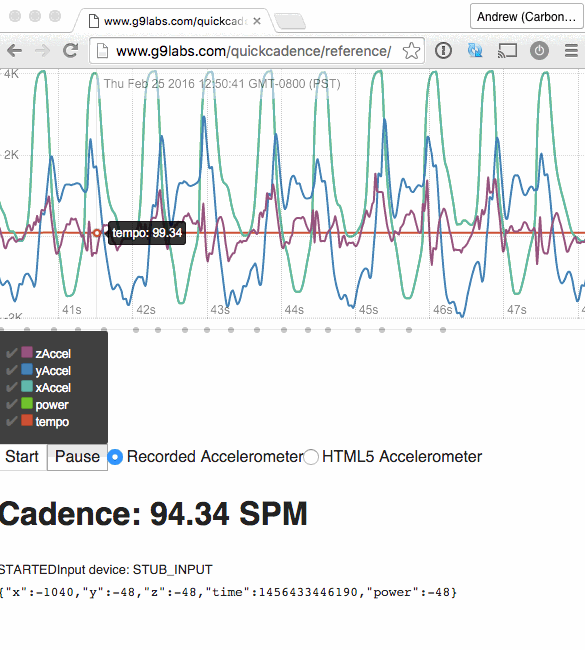

class: middle

# Reactive Programming for Couch Potatoes

*(Nothing against couch potatoes)*

---

class: middle

# Hi, I'm Andrew.

Friendly neighborhood programmer at Carbon Five.

---

class: background-image-contain middle center


---

class: middle

## I've been an OO programmer for a very long time.

The paradigms there have served me well.

???

As an OO programmer, I've had a lot of exposure to tried-and-true
aphorisms: the law of demeter. Different modeling patterns.

---

class: middle

## But the functional world was beckoning

* Declarative over imperative
* Pure functions
* Dataflow
* Not having to worry so much about state

???

I read about the powerful functional constructs and combinators. I was
dazzled by how people described this new world.

---

class: middle

## I'm a runner.

I've been running for a very long time.

---

class: middle center

#### *(Consistently injured for just as long.)*

---

class: middle

## How do I stop getting hurt?

Develop a quicker stride rate

---

class: middle

## Run with a metronome

So you can learn to internalize the correct stride cadence.

???

Sidebar discussion: focusing on cadence is good for your run form. But
that's a talk for another meetup.

---

class: middle

## Let's dive into reactive

Let's make a pedometer!

???

Reactive programming was my way to both sharpen my functional toolbelt,
but also a way for me to try to get better in my training as a runner
and athelete.

---

class: middle center

#### *(Couch potatoes unite.)*

---

## Today's talk

* Intro to FRP
* RxJS
* Building a pedometer
* Cycle.js
* Throwing it on a Pebble watch

---

class: middle

I've heard it said:

### "Reactive programming is programming with asynchronous data streams."

---

class: middle

# Oh my.

---

class: middle

OK. Back up. Let's talk about streams.

## Streams are like pipes.

---

class: middle white-text

background-image: url(images/pipes_oops.jpg)

## Streams are like pipes.

--

background-image: url(images/pipes2.jpg)

--

background-image: url(images/pipes.jpg)

???

You'll want to sit down and get comfortable here.

What is a stream? A stream is like a pipe. Like a UNIX pipe, but more
colloquially, like a plumbing pipe. Like you're trying to hook up a faucet to the
water main, kind of pipe.

---

class: small-code

### Helpful (?) analogy

Streams are asynchronous arrays that change over time.

```js
let prices = [1, 5, 10, 11, 22]

// 5 seconds later...
[1, 5, 10, 11, 22, 44]

// 10 seconds later...
[1, 5, 10, 11, 22, 44, 100]
```

???

You might also think about it like having an Array that you never get to
peek the entireity of, because it may potentially be infinite.

---

### Hopefully more helpful analogy

Streams are like arrays, only:

* You can't peek "into" the stream to see the past or future.
* You're holding onto the end of the pipe!

--

But if you counted up all the values you saw coming out of the end of
the pipe, you could basically piece that array back together.

---

class: middle

```js
prices: --[1]
```

---

class: middle

```js
prices: --[1]--[5]
```

---

class: middle

```js
prices: --[1]--[5]----[10]
```

---

class: middle

```js
prices: --[1]--[5]----[10]-------[11]
```

---

class: middle

```js
prices: --[1]--[5]----[10]-------[11]------...
```

???

Point being here that you choose to transform a value coming out at the
end of the pipe.

---

### Streams are in:

Look familiar?

- Unix pipes `|` `>` ..
- Websockets
- Node `streams` lib
- Gulp
- Express

???

Where have you seen streams before? A WebSocket. Anything in Node that
opens a file, or starts a web request (usually backed by an
EventEmitter).

---

### An aside on Node streams

```js
    +-----+   +-----+   +-----+
+-> |  A  +-> |  B  +-> |  C  +->
    +-----+   +-----+   +-----+
```

You may be familiar with Node streams.

* Chainable with `pipe()`
* Backpressure capabilities to handle mismatched producers/consumers


---

### An aside on Node streams

```js
    +-----+   +-----+   +-----+
+-> |  A  +-> |  B  +-> |  C  +->
    +-----+   +-----+   +-----+
```

* BUT: You must manage stream state: `start`, `data`, `end`.
* BUT: lack of expressive functional operators

---

class: middle

### Let's forget you've ever heard about them (for now).

???

Trust me, this will help clear out the terminology.

---

class: middle

### "Reactive programming is programming with asynchronous data streams."

???

Back to the mantra of Reactive Programming...

---

class: middle 

## streams = `Observable`s

We will use the terms interchangeably tonight.

???

OK, I promise I'll never do this to you again, but this name change is
going to help. Streams are also termed Observables in Rx-land because
they are like Arrays (or more generically, Sequences) that continuously
grow over time, and their changing value sequences are, well, observable.

Like you can subscribe to them, and see how they change.

---

### F is for Functional.

```js
let f = (x) => x + 4
```

```js
     +------+
1 +--> f(x) +--> 5
     +------+
```

???

Let's recap: a function is a relationship between a set of inputs and a set of outputs.

---

### F is for Functional.

```js
let f = (x) => x < 10
```

```js
     +------+
1 +--> f(x) +--> false
     +------+
```

--

You just wait. There's lots more boxes and arrows where that came from.

???

The F in FRP relates to the fact that we are going to be using functions to transform data and connect transformed inputs and outputs.

---

class: middle

## Streamify all the things.

Now let's think of these functions in the context of streams.


???

I'm going to introduce a new way of seeing code. We're going to take a
timeline of values that pop into existence asynchronously. Meaning,
you're looking at a potentially unbounded array of size infinity, but
you don't know how long the stream will continue to emit data, or whence
it will fire. All you know is how to hook up your stream to react to the
next thing coming down the pipe.

Let's go back and look at our `map` example, but this time, `data` will
be `dataStream`, some sampling of data that is generated asynchronously.
Maybe it's from a file, maybe it's from a websocket.

---

class: middle

## Step by step, build the pedometer.

---

### Normalize the Accelerometer data


---

class: xsmall-code

### Normalize the Accelerometer data

```js
let motionData = eventsFromAccelerometer()
let normalData = motionEvents.map(acceleration => acceleration.y);
```
```marbles
motion: ---[{x:1,y:1,z:1}]--[{x:1,y:2,z:2}]--[{x:1,y:-100,z:1}]-->
normal:  ---[1]--------------[2]--------------[-100]-->
```

```marbles
     +-----------+         +------------+
+--> |motionData +-------> |normalData  +-->
     +-----------+         +------------+
                    {x:1,                  1
                     y:1,
                     z:1}
```
---

## Whoa, what was that?

```marbles
  data: ---[1]--[2]--[-100]-->
output: ---[t]--[t]--[f]----->
```

Marble diagrams are a thing:
[RxMarbles](http://rxmarbles.com/)

---

background-image: url(images/rxmarbles.png)

---

### Your Rx functional toolbelt

* `map`
* `filter`
* `zip`
* `flatMap`
* `reduce`
* `concatMap`
* `scan`
* `pausable`
* `debounce`

--

Special stream-oriented nuances.

???

These look like normal operators, until you start to realize they have
specific time, or stream-oriented properties.

---

class: xsmall-code

### Peaks and troughs = steps

```marbles
 accel(m^2/s)
           20 ^
              |         XXXXX
           15 |      XXXX   XXX            XXX
              |    XXX        XX         XXX
           10 |   XX           X       XXX
              | XX             XXX   XXX
           5  |XX                XXXXX
              +--------------------------------> time (s)
                 1   2   3   4   5   6   7   8
```

```marbles
delta:      -[5]-[4]-[2]-[-2]-[-5]-[2]-[3]-[4]->
change:     -[+]-[+]-[+]-[-]--[-]--[+]-[+]-[+]->
stepEvents: -------------[S]-------[S]--------->
```

--

Little known fact: the derivative of acceleration is also called a jerk.

???

We're mathing the derivative of acceleration - which is also known as a "jerk". But we really only care about jerks that shifts from positive to negative - meaning that the person is shifting their weight downward.

---

class: xsmall-code

```js
// stream items of form: { power: 10, time: 1432485925 }
function detectSteps(stream) {
  return stream
  // Group elements in sliding window of pairs
  .pairwise()
  // Calculate change and step signals
  .map(([e1, e2]) => {
    let powerDiff = e2.power - e1.power;
    let changeSignal = powerDiff > 0;
    return {
      "timestamp": e1.time,
      "diff": powerDiff,
      "changeSignal": changeSignal
    }
  })
  // Every time a changeSignal flips, then the event
  // becomes a step signal.
  .distinctUntilChanged(v => v.changeSignal)
  // Smooth out erratic changes in motion.
  .debounce(DEBOUNCE_THRESHOLD)
};
```

---

class: middle xsmall-code

### Voila! A beautiful pedometer.

```
          +--------------+    +------------+   +-----------------+
{xyz} +-> |normalizeData +->  |detectSteps +-> |calculateCadence +-> 66.31
          +--------------+    +------------+   +-----------------+
```

---

class: middle xsmall-code

### Voila! A beautiful pedometer.

```

        +--------------------------------------------------------+
        |+--------------+    +------------+   +-----------------+|
{xyz} +>-|normalizeData +->  |detectSteps +-> |calculateCadence |--> 66.31
        ||              |    |            |   |                 ||
        |+--------------+    +------------+   +-----------------+|
        |                    CadenceCounter                      |
        +--------------------------------------------------------+

```

---

class: middle

So we made a pedometer. Big deal.

## Try making an app.

???

So we made a pedometer, which is basically a transformation function.

Let's do some more complicated things. Like make an app.

Apps are complicated because they have to account for intermediate state. They have to coordinate between multiple inputs and outputs.

---

class: middle

#### *(Psst. We'll only need streams.)*

---

### FRP apps follow a common pattern:

1. **Transform inputs** with `map()`
--

2. **Recompute state** with `scan()`
--

3. **Update outputs** with `map()` and `filter()`

???

I'm going to keep harping on this slide, but it's important. The core
architecture of FRP apps involves these three steps. If you've fallen
asleep during this lecture, this is the time to wake up and take notes:

---

class: small-code middle

```marbles
         +------+    +------+      +-----+---------+
in +---> | map  +--> |      |  +-->+ map | filter  +---> out
         +------+    |      |  |   +-----+---------+
                     | scan +--+
         +------+    |      |  |   +-----+---------+
in +---> | map  +--> |      |  +-->+ map | filter  +---> out
         +------+    +------+      +-----+---------+

         1) Xform    2) Recompute  3) Update
```

--

* `in`: DOM events. Domain events. HTTP responses.
* `out`: DOM updates. Domain events. HTTP requests.

---

### 1. Transform inputs with `map()`

*Ask yourself:* What are the inputs into the app?

---

class: small-code

Well, we have our accelerometer.

```js
let accelerometerData =
  Rx.Observable.fromEvent(window,
                          'devicemotion')
  .map(e => Object.assign({}, e.accelerometer))

// accelerometerData: --[ { x:, y:, z: } ]--->
```

???

Our first task is to think through our app and ask: what are all the
inputs from the world? Well we're in luck - the only input this app will
take is from the accelerometer itself.

--

We should also plug that into our pedometer.

```js
let cadence = cadenceCalculator(accelerometerData)
.map(cadence => ({ name: CADENCE_EMITTED,
                   value: cadence }))

// cadence: --[ { name: CADENCE_EMITTED, value: 66.1234 } ]-->
```

---

class: small-code

### Transform inputs, cont'd

There's also DOM event data to account for:

```js
let startButton =
  Rx.Observable.fromEvent($('button#start'), 'click')
  .map((e) => { { name: 'START' } } }

// startButton: --[ { name: 'START' } ]-->
```

---

class: xsmall-code

### Merge these together into an input stream:

```js
let actions = Rx.Observable.merge(
	startButton,
	cadence
)

// actions: --[ { name: START } ]--
//            [ { name: CADENCE_EMITTED, value: 66.1234 } ] -->
```

---

### 2. Recompute application state with `scan()`.

*Ask yourself:* What is the minimum amount of state that my app needs to
store?

- A: Anything that the UI is dependent upon
- A: Anything that stores a value that is necessary for future events to
compute from.

???

Here's another key principle of FRP: state is computed solely from the
events that come in over our input streams, and nothing more. Let's see
this in action.

First, we consider what state means to this application. What data do we
need to store from event to event to be meaningful to our application?
We need:

---

### Application state for this app:

```js
const initialState = {
  cadence: 33.1234,
  runState: STOPPED,
}
```
--

Note how it is a simple data structure.

---

class: xsmall-code

Next we update the application state based on the current (incoming) event.

```js
let currentState = actions.scan(
  (oldState, action) => {
    switch(action.name) {
    case START:
      return Object.assign({}, oldState { runState: STARTED })
    case CADENCE_EMITTED:
      return Object.assign({}, oldState, { cadence: action.value })
    default:
      return oldState
    }
  }, initialState)
  .startWith(initialState);

// actions: --------------[START]------[CADENCE_EMITTED]--->
// current: -[{STOPPED}]--[{STARTED}]--[{STARTED, 66.1234}]-->
```

???

Each time an event comes in, currentState recomputes new state and sets
its accumulated value to the new value. Note how we formulate
`initialState` and set it to some state that makes sense.

---

class: small-code

### 3. Update outputs (UI) upon state change.

Conditionally update the UI based on the state of the app's `runState`.

```js
currentState
.filter(newState => newState.runState === STARTED)
.subscribe(newState => {
  $('.output').text(
    `${newState.cadence} steps per minute (SPM)`
  );
});
```

???

Now we need to think of the system output. Once the state has been
recomputed, what needs to change? In our app's world, there is a simple
piece of UI that needs to update.

---

class: small-code

### Extra RxJS bit: call `subscribe` to activate the stream and perform side effects.

```js
currentState.subscribe(newState => {
  // Do side effects like:
  // Render the DOM
  // Make an HTTP request
  // Push an event onto a Websocket
});
```

--

Careful! Streams are lazily evaluated!

???

RxJS tries to be smart and only process signals when it has to, meaning
streams do not become active until they are `subscribe()`ed to.
Additionally, your side effects (meaning updating the UI) should occur
from within the `subscribe()` call.

---

class: center middle

Phew! Let's [see it in action](http://g9labs.com/quickcadence/reference).

[http://g9labs.com/quickcadence/reference](http://tinyurl.com/rxcadence)

---



---

## FRP overall pattern

| FRP Principle   |
|-----------------|
| Map inputs      |
| Recompute state |
| Update output   |

--

Cycle.js: [Reducer pattern](http://staltz.com/reducer-pattern-in-cyclejs.html)

Redux: [Actions/Reducers/React](http://redux.js.org/docs/basics/Reducers.html)

Elm: [Model/Update/View](https://github.com/evancz/elm-architecture-tutorial)

--

Watch as we apply these to other frameworks.

---

## From Elm...

| FRP Principle   | Elm              |
|-----------------|------------------|
| Map inputs      | `Action`         |
| Recompute state | `Model`          |
| Update output   | `View`, `Effect` |

???

Ajax (side effects)

Compose actions as Effects

---


---

class: background-image-contain

background-image: url(images/elm-program.png)

---

## Elm, cont'd

1. transform inputs to streams (`map`)
2. merge inputs into signal (`merge`)
3. update state of app architecture (`foldp`)
4. route values to appropriate service (`filter`)

---

## ...to Redux

| FRP Principle   | Redux     |
|-----------------|-----------|
| Map inputs      | `Action` is a Redux event    |
| Recompute state | `Reducer` applied on a store |
| Update output   | `React` to update UI         |

---

## In Redux:

```
reducer = (state, action) => state
```

1. Actions are inputs
2. State is recomputed with reducers
3. Updates & side effects are created from state (React)

---

class: background-image-contain

background-image: url(images/redux-arch.png)

---

## FRP elsewhere

#### Netflix has some fantastic Reactive talks.

RxJS, Falcor, RxJava (Hystrix, circuit breakers)

#### Many other FRP frameworks/languages out there.

Cycle.js, Bacon.js, Highland.js, ClojureScript, Elm

---

### Further reading (and many thanks!)

* ["The Introduction to Reactive Programming You've Been Missing"](https://gist.github.com/staltz/868e7e9bc2a7b8c1f754)
* ["OMG Streams!"](https://www.youtube.com/watch?v=3iKkwzlch0o)
* RxMarbles: http://rxmarbles.com/
* ReactiveX: http://reactivex.io/learnrx/

---

## Recap

* Learn to see everything as a stream.
* Dataflow programming is powerful.
* FRP frameworks provide lots of tools. Use them!
* The pattern:
  - Map inputs
  - Recompute state
  - Update output

---

class: middle center

### I made a pedometer, I swear.

[https://github.com/andrewhao/quickcadence](https://github.com/andrewhao/quickcadence)

---

class: middle center

### Thanks!

https://www.github.com/andrewhao
https://www.twitter.com/andrewhao

---

class: middle

### Image attributions:

* https://www.flickr.com/photos/alphageek/210677885/
* https://www.flickr.com/photos/95744554@N00/156855367/
* https://www.flickr.com/photos/autowitch/4271929/
* https://www.flickr.com/photos/internetarchivebookimages/14776039484
